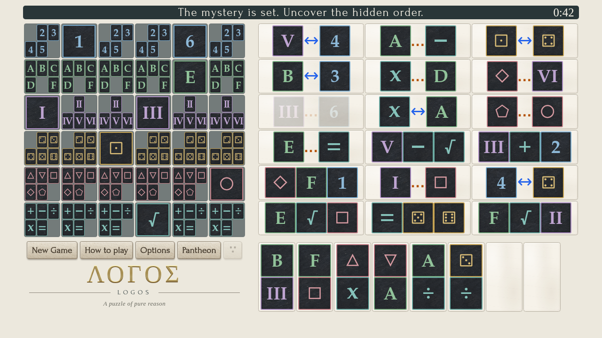

Logos
=====

Logos is a browser-based logic puzzle inspired by the "Einstein" puzzle
game. The version I have played is made by Flowix Games, but that is
apparently a port of an old DOS game called "Sherlock". Logos takes its
gameplay from the Flowix version, but the code was written from scratch.

Build/Install
=============

There is no build or install step. You should be able to view
`index.html` directly in a browser. Instructions are provided within the
game page itself.

The tile font is derived from TeX Gyre Pagella Bold, and can be
regenerated by running:

    python3 fonts/generate-tile-font.py texgyrepagella-bold.otf fonts/logos-tiles.woff2

A copy of the generated font is included in the repository for
simplicity.

Tests
=====

Run `./test` for the Deno test suite. Open
`tests/logos-storage-test.html` in a browser to run the storage tests.

Puzzle links
============

Append `#seed=1234abcd` to the page URL to link to a particular puzzle
(seeds are up to 8 hexadecimal digits). Choose "Accept" to begin it.

Zen completions
===============

Solo Zen completions appear in the Chronicle with an infinity symbol instead
of a time. They do not enter the Pantheon or its win/loss totals. Continuing
after a loss preserves the timed loss and adds an untimed win if you finish;
abandoning the puzzle leaves only the loss.
